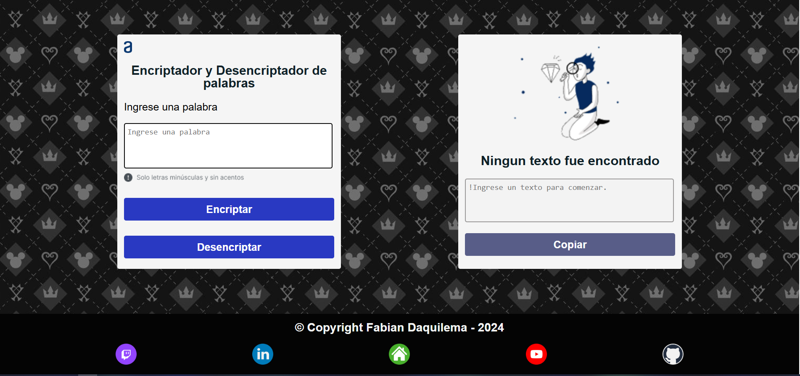

## Encriptador y desencriptador de texto

La pagina fue hecha como parte de un proyecto para un curso y su funcion es el de encriptar las vocales de una palabra o frase para luedo desencriptarlos.

Para un mejor visualisacion puede consultarlo con la imagen.

